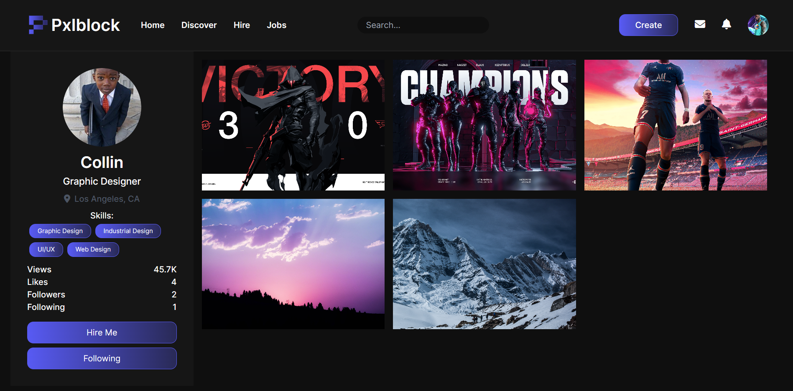

# Pxlblock
- Creative platform to showcase portfolios and connect with clients
-  Utilizes the ReactJS framework for a dynamic and responsive frontend user interface
-  Created a REST API using the Django framework to handle data management and authentication on the backend

## Home
.PNG>)

## Profile

## Login

